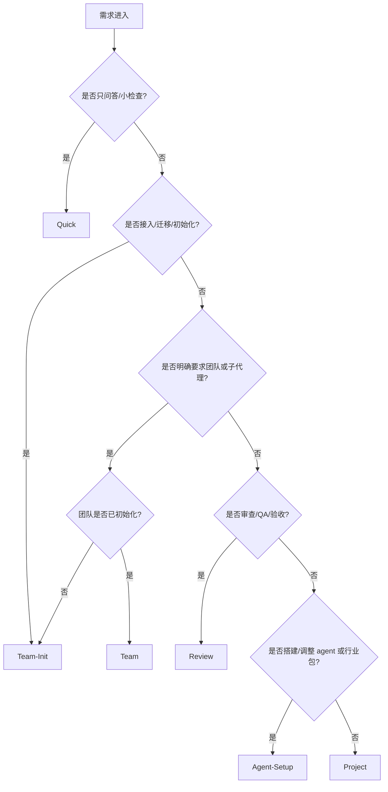

# 工程结构与文档路由

本文件是团队模板的文档导航层。根入口 `AGENTS.md` 负责快速路由，本文件说明每类任务应该读取哪些资料，避免主线程上下文膨胀。目标项目如果采用 `docs/` 或其他文档根目录，以 `.codex/team-kit.toml` 的 `docs_root` 为准。

## 快速入口

- 项目稳定规范：`Docs/01-项目/项目规范.md`
- 当前状态和下一步：`Docs/01-项目/项目进度.md`
- 团队结构和验收门禁：`Docs/03-团队/开发团队.md`
- AI 执行流程：`Docs/02-执行/AI执行手册.md`
- 子代理调度协议：`.codex/team/dispatch-protocol.md`
- 工作流 hooks：`.codex/hooks.json` 和 `.codex/hooks/`
- 公共文件写锁：`.codex/team/public-file-lock.md`
- 模型路由：`.codex/team/model-routing.md`
- 角色分类：`.codex/team/role-taxonomy.md`
- 派发 prompt 模板：`.codex/team/spawn-prompt-templates.md`
- 模板接入配置：`.codex/team-kit.toml`
- 行业扩展包说明：`Docs/03-团队/行业扩展包/README.md`

## 路由决策树

```text
需求进入
├─ 用户只问问题、只查一个点、无需改文件
│  └─ Quick
├─ 需要普通实现、规划、文档更新或局部修复
│  └─ Project
├─ 用户给 GitHub 地址接入模板，或涉及初始化、迁移、行业包选择
│  └─ Team-Init
├─ 用户明确允许团队流程 / 子代理 / 并行 agent
│  ├─ 团队未初始化
│  │  └─ Team-Init
│  └─ 团队已初始化
│     └─ Team
├─ 用户要求审查、QA、安全、回归、验收
│  └─ Review
└─ 用户要求搭建或调整 agent、角色、行业包
   └─ Agent-Setup
```



## 路由说明

### Quick

用于简单问答、小范围检查、无需改动的快速判断。

读取：

- `AGENTS.md`
- 用户明确点名的文件

禁止：

- 自动读取完整 `Docs/`
- 自动派发子代理

### Project

用于普通规划、实现、局部修复和文档更新。

读取：

- `Docs/01-项目/项目规范.md`
- `Docs/01-项目/项目进度.md`
- `Docs/02-执行/AI执行手册.md`
- 与任务直接相关的业务文件

### Team

用于已初始化项目的日常团队流程、子代理或并行 agent 任务。

读取：

- `Docs/02-执行/Team运行卡.md`

按 `Team运行卡.md` 判断是否需要继续读取：

- `.codex/team/dispatch-protocol.md`
- `.codex/team/model-routing.md`
- `.codex/team/public-file-lock.md`
- `Docs/03-团队/开发团队.md`
- `Docs/02-执行/AI执行手册.md`

要求：

- 先生成 Team Assignment Map 和 Delegation Card。
- 走 Team-lite / delta policy：每波至少沉淀一份工作记录，且逐一列出参与者贡献。
- 成员档案只在新增可复用经验时更新。
- 团队名册按参与者更新最近任务和任务次数，同时只更新必要状态字段。
- 子代理只拿压缩上下文包。
- 主线程统一验收和回写公共文件。
- 公共文件写入前，确认所有本波子代理状态为 completed/closed。

### Team-Init

用于团队初始化、模板接入、迁移和扩展包选择。

读取：

- `Docs/03-团队/Agents/团队初始化.md`
- `.codex/team-kit.toml`

按初始化文档再追加读取行业包、agents、开发团队、AI 执行手册或派发协议。

要求：

- 若团队名册仍是 `pending`，先执行团队初始化。
- 初始化时必须选择行业扩展包，未选中的扩展包不复制到 `.codex/agents/`。
- 使用 GitHub 地址接入时，模板只能先进入 staging 目录，不能直接拉到项目根目录。

### Review

用于代码审查、QA、安全、回归和验收。

读取：

- `Docs/02-执行/AI执行手册.md`
- `.codex/team/public-file-lock.md`
- `Docs/03-团队/Agents/交付模板/QA验收模板.md`
- 差异、测试结果或用户指定的交付物

要求：

- 优先找真实风险、行为回归、缺失验证和残余风险。
- 不直接修复，除非用户明确授权。

### Agent-Setup

用于搭建、扩展或调整团队模板。

读取：

- `Docs/03-团队/开发团队.md`
- 本文件
- `.codex/team/role-taxonomy.md`
- `.codex/team/model-routing.md`
- `.codex/team/public-file-lock.md`
- `.codex/team/spawn-prompt-templates.md`
- `.codex/agents/*.toml`
- `.codex/agent-packs/`
- `Docs/03-团队/行业扩展包/README.md`

要求：

- 新角色必须有清晰边界。
- 新角色必须禁止修改公共文件。
- 不一次性引入过多角色；优先少量高价值 agent。
- 行业角色优先放进 `.codex/agent-packs/{industry}/`，初始化选择后才复制到 `.codex/agents/`。
- 接入流程必须保留 staging 合并清单，并在完成后删除 staging 目录。

## 维护规则

- 改入口路由，只改 `AGENTS.md` 和本文件。
- 改执行流程，只改 `Docs/02-执行/AI执行手册.md`。
- 改团队结构，只改 `Docs/03-团队/开发团队.md` 和 `.codex/agents/*.toml`。
- 改子代理派发规则，只改 `.codex/team/dispatch-protocol.md`。
- 改公共文件写锁，以 `.codex/team-kit.toml` 的 `[public_files]` 为标准源，并同步 `AGENTS.md` 摘要、`.codex/team/public-file-lock.md`、`.codex/team/spawn-prompt-templates.md` 和 `.codex/agents/*.toml` 中的禁止清单。
- 每次改团队模板结构后运行 `.codex/tools/check_template_integrity.py`。初始化后的目标项目用 `.codex/hooks.json` 做官方工作流 hook，`.codex/hooks/` 保留 handler 和手动 gate；需要对齐官方行为时，先查当前 OpenAI Codex 官方文档。
