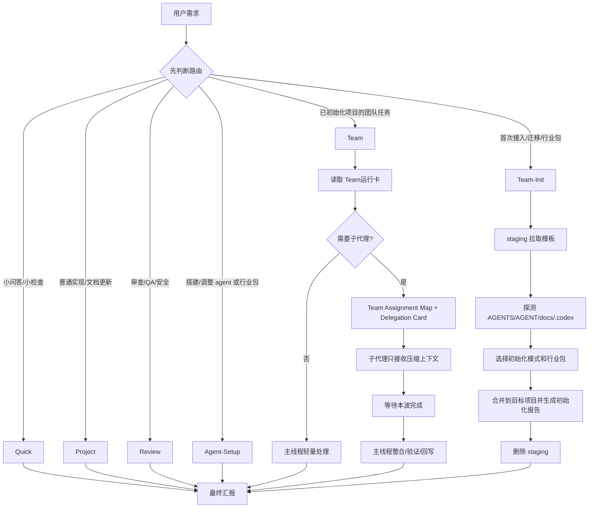

# codex-team-kit-router

`codex-team-kit-router` 是一套路由式 Codex 子代理团队模板。它的目标不是把一大堆规则一次性塞进主线程，而是让 Codex 先通过瘦 `AGENTS.md` 判断任务类型，再按需读取 `Docs/` 和 `.codex/` 中的具体规则。

这套模板适合已经有项目文档、项目进度、`AGENTS.md` / `AGENT.md` 或 `.codex/` 的项目。接入时必须先放到临时 staging 目录，探测目标项目后按清单合并，完成体检后删除 staging，避免把模板仓库直接塞进项目根目录。

## 30 秒接入

1. 复制仓库地址：`https://github.com/ZainDarcy/codex-team-kit-router`
2. 把下方“推荐接入方式”里的 prompt 发给目标项目里的 AI，不要自己在终端把仓库直接 clone 到项目根目录。
3. 等 AI 给出初始化或重新初始化报告，检查：staging 已删除、成员身份已保留或创建、行业包选择已说明、rollback 入口已保留。

## 一句话理解

- `AGENTS.md`：Codex 入口路由器，只放最短硬规则。
- `Docs/`：项目文档、团队说明、初始化说明、成员档案和工作记录模板。
- `.codex/`：Codex 运行配置、agent TOML、行业扩展包、派发协议、官方 hooks、工作流脚本和体检脚本。
- `.codex/agents/`：已经启用的 agent 定义。
- `.codex/agent-packs/`：可选行业扩展包模板源，初始化选择后才复制到 `.codex/agents/`。

## 推荐接入方式

把下面这段发给目标项目里的 AI：

```text
请参考并接入这个 Codex 团队模板：
https://github.com/ZainDarcy/codex-team-kit-router

要求：
1. 不要把模板仓库直接拉到项目根目录；先新建临时 staging 目录拉取模板，优先放在项目根目录外。
2. 先探测目标项目已有 AGENTS.md、AGENT.md、docs/Docs、项目规范、项目进度和 .codex/，不要直接覆盖。
3. 在 .codex/team-kit.toml 里确定 docs_root、项目规范、项目进度、团队目录、公共文件清单和 staging 策略。
4. 选择初始化模式；默认用团队就绪模式。Router-only 试接入不算团队初始化完成。
5. 必须选择行业扩展包：none、game-basic、game-full 或 custom；不要默认偷偷加入。
6. 按我的项目语言习惯随机给团队成员起真实人名，并初始化团队名册和成员档案。
7. 按合并清单把需要的文件融入项目，安装 `.codex/hooks.json` 和 `.codex/hooks/`，运行体检，删除 staging 目录，再汇报真相源、改动文件、未生成/未迁移内容和 staging 清理结果。
```

初始化完成后，普通任务可以直接说：

```text
按轻量模式处理这个需求：...
```

需要团队流程或子代理时说：

```text
按开发团队流程执行这个需求，允许使用子代理：...
```

只想先规划时说：

```text
先给我一版子代理分工方案，不要执行：...
```

什么时候不用团队流程：

- 小问答、小检查、小修复：用轻量模式。
- 只想要方案：用“只规划分工，不执行”。
- 中大型迭代先过方案门禁：先落范围、验收和回退风险，用户批准范围后再实现。
- 跨模块、高风险、需要审查或并行工作：再用团队流程。

## 工作流程总览

```text
用户需求
├─ 小问答 / 小检查
│  └─ Quick：只读 AGENTS.md 和用户点名文件
├─ 普通实现 / 文档更新 / 局部修复
│  └─ Project：读取项目规范、项目进度、AI 执行手册
├─ 首次接入 / 重新初始化 / 迁移 / 行业包选择
│  └─ Team-Init：staging 拉取 -> 探测目标项目 -> 合并清单 -> 初始化或升级团队 -> 删除 staging
├─ 已初始化项目里的团队任务
│  └─ Team：先读 Team运行卡
│      ├─ 不需要派发：主线程轻量处理
│      └─ 需要派发：Team Assignment Map -> Delegation Card -> 子代理压缩上下文 -> 等待完成 -> 主线程整合
├─ 审查 / QA / 安全 / 回归
│  └─ Review：读差异、验证结果和 QA 模板
└─ 搭建 / 调整 agent / 行业包
   └─ Agent-Setup：读角色、模型、公共写锁和相关 TOML
```



## 非侵入式 Staging 接入

接入已有项目时，模板仓库只能作为临时来源，不能成为目标项目的一部分。

必须遵守：

- 禁止把 `codex-team-kit-router/` 直接 clone 到目标项目根目录并长期保留。
- 禁止在目标项目根目录做整目录覆盖式复制。
- AI 必须先在 staging 目录中读取模板、探测目标项目、生成合并清单。
- staging 优先放在项目根目录外。
- 如果只能临时放在项目内，使用 `_codex-team-kit-router-staging/`，写入 `.gitignore`，完成后删除。
- 合并到目标项目时，只落盘被选择的文件和被选择的行业扩展 agents。
- 完成后必须删除 staging；删除失败时，最终汇报必须列出残留路径和原因。

## 初始化模式

| 模式 | 适合场景 | 会生成什么 |
| --- | --- | --- |
| Router-only 试接入 | 只想先接入 Router 和基础规则，不算团队初始化完成 | `AGENTS.md`、核心 `.codex/`、公共写锁、派发协议、体检脚本；首次 Team 路由前必须再补团队档案 |
| 团队就绪模式 | 推荐默认，准备正常使用团队流程 | Router 基础内容，加团队名册和核心 agent 成员档案；不创建虚假的初始工作记录 |
| 完整模式 | 长期项目，需要完整团队沉淀 | 团队就绪模式内容，加交付模板和完整团队文档结构 |

初始化报告必须说明采用哪种模式。

## 行业扩展包

行业扩展包是可选的。初始化时必须明确选择，不允许默认偷偷加入。

当前选择项：

| 选择 | 含义 |
| --- | --- |
| `none` | 非垂直项目或暂不需要行业专家时使用 |
| `game-basic` | 游戏原型、早期玩法验证时推荐；加入 `game_designer`、`gameplay_engineer`、`ui_artist`、`playtest_researcher` |
| `game-full` | 长期游戏项目推荐；加入策划、程序、美术、验证全部分组 |
| `custom` | 已明确只需要某些岗位时使用，例如只加战斗策划、数值策划和 UI |

游戏行业包分组：

| 分组 | Agents | 职责 |
| --- | --- | --- |
| 策划 | `game_designer`、`combat_designer`、`balance_designer`、`level_designer` | 核心玩法、战斗、数值、关卡 |
| 程序 | `gameplay_engineer`、`ui_engineer` | 玩法系统、UI/HUD、运行时实现 |
| 美术 | `game_art_director`、`ui_artist`、`technical_artist` | 美术方向、UI 视觉、资产接入、技术美术 |
| 验证 | `playtest_researcher` | 可玩性、手感、节奏、玩家反馈 |

未选择的扩展包只保留在 `.codex/agent-packs/` 作为模板源，不进入 `.codex/agents/`、团队名册或成员档案。

游戏项目示例：

```text
当前项目是早期 Web 游戏原型，接入时选择 game-basic。初始化后先按玩法原型派发模板做一轮评估：策划、玩法工程、UI 视觉和试玩验收分别给建议，主线程最后合成迭代计划，不要直接实现。
```

```text
评估是否需要 Unity/Cocos 迁移，选择 custom，只启用必要的设计、工程和技术美术视角。先区分代码优先、编辑器依赖、资源管线和迁移成本，不要直接建议迁移。
```

## 路由类型

| 路由 | 适用场景 | 主要读取 |
| --- | --- | --- |
| `Quick` | 简单问答、小检查、无需改动 | `AGENTS.md` 和用户点名文件 |
| `Project` | 普通实现、规划、局部修复、文档更新；中大型迭代先过方案门禁 | 项目规范、项目进度、AI 执行手册 |
| `Team` | 已初始化项目的日常团队流程、子代理、并行 agent | Team 运行卡，再按卡片追加调度文件 |
| `Team-Init` | 团队初始化、重新初始化、模板接入、迁移、扩展包选择 | 团队初始化、`.codex/team-kit.toml`，再按需读取行业包和派发协议 |
| `Review` | 审查、QA、安全、回归、验收 | AI 执行手册、公共写锁、QA 模板 |
| `Agent-Setup` | 搭建或调整团队模板、agent 定义、行业包 | 角色分类、模型路由、公共写锁、agent TOML、行业扩展包 |

## 关键文件

详细目录树见 `Docs/README.md`。日常不要把下面文件一次性全读进上下文，按路由取用：

| 场景 | 优先读 |
| --- | --- |
| 入口路由 | `AGENTS.md` |
| 目标项目状态 | `Docs/01-项目/项目规范.md`、`Docs/01-项目/项目进度.md` |
| 普通执行 | `Docs/02-执行/AI执行手册.md` |
| 中大型迭代方案 | `Docs/02-执行/实施方案/README.md` |
| 日常 Team | `Docs/02-执行/Team运行卡.md`，需要派发时再读 `.codex/team/dispatch-protocol.md` |
| 团队初始化 | `Docs/03-团队/Agents/团队初始化.md`、`Docs/03-团队/行业扩展包/README.md`、`.codex/team-kit.toml` |
| agent / 行业包调整 | `.codex/agents/`、`.codex/agent-packs/`、`.codex/team/model-routing.md`、`.codex/team/role-taxonomy.md` |
| 本地体检 | `.codex/tools/check_template_integrity.py`、`.codex/hooks.json`、`.codex/hooks/` |

## 团队任务必须产出什么

每次走 `Team` 路由并实际启用子代理，主线程最终回复前必须确认：

- 本波工作记录已按模板落盘，并逐一列出参与者、产出和验证。
- `Docs/03-团队/Agents/团队名册.md` 已按参与者更新团队名册，记录最近任务和任务次数。
- 对应成员档案仅在新增可复用经验时创建或更新。
- 所有本波子代理状态已记录为 completed/closed，或说明例外原因。
- 最终回复说明谁干了什么、产出了什么、验证了什么、哪些建议被采纳。

只读 / dry-run 且未启用子代理、未改文件时不落盘团队记录。主线程独自完成实际 Team 工作时，写 `main-thread` 工作记录并说明未派发原因。

## 本地体检

复制、初始化或调整模板后运行：

```bash
python3 .codex/tools/check_template_integrity.py
```

该脚本只做本地模板结构体检，不修改文件、不联网，也不代表 OpenAI/Codex 官方规则校验。它会检查路由、链接、`.DS_Store`、行业包选择值和部分运行态文档体量预算，但不会精确测量真实 prompt token。需要确认当前官方行为时，应让 AI 先查当前 OpenAI Codex 官方文档，再更新模板。

`.codex/hooks.json` 是 Codex 官方工作流 hook 配置，项目 `.codex/` 被信任后可在 `/hooks` 里审查启用；它覆盖 `SessionStart`、`UserPromptSubmit`、`PreToolUse`、`PermissionRequest`、`PostToolUse` 和 `Stop`。`.codex/hooks/` 放 handler 与手动 fallback gate：初始化后运行 `post-init`，中大型迭代进入写入前运行 `pre-implementation`，派发团队前运行 `pre-team-dispatch`，最终回复前运行 `pre-final`。

本仓库还提供 repo-local `.githooks/`。在模板维护仓库中把 `core.hooksPath` 指向 `.githooks` 后，`pre-commit` 会自动运行体检和 `git diff --check`；`pre-push` 会追加体检脚本语法编译和 `.DS_Store` 扫描。

## 维护原则

- 改入口路由：优先改 `AGENTS.md` 和 `Docs/02-执行/工程结构与文档路由.md`。
- 改执行流程：优先改 `Docs/02-执行/AI执行手册.md`。
- 改团队结构：优先改 `Docs/03-团队/开发团队.md` 和 `.codex/agents/*.toml`。
- 改行业扩展包：优先改 `.codex/agent-packs/{industry}/` 和 `Docs/03-团队/行业扩展包/README.md`。
- 改公共写锁：同步 `.codex/team/public-file-lock.md`、`AGENTS.md`、`.codex/team/spawn-prompt-templates.md` 和相关 agent TOML。
- 改完模板结构后，必须运行本地体检。
